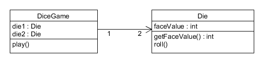

# 系统设计与分析homework2
## 1、简答题
### a. 用简短的语言给出对分析、设计的理解。
- 分析是将复杂的话题或事物逐渐拆分的过程，以此来达到对话题更好的理解。
- 分析强调的是对问题和需求的调查研究，而不是解决方案
- 设计指有目标和计划的创作行为、活动。
- 设计强调的是满足需求的概念上的解决方案（在软件方面和硬件方面），而不是其实现。

### b. 用一句话描述面向对象的分析与设计的优势。
面向对象的分析与设计把易变的数据结构和部分功能封装在对象内并加以隐藏，保证了对象行为的可靠性，有利于维护，对需求变化有较强的适应性，而且有利于复用对象。

### c. 简述 UML（统一建模语言）的作用。考试考哪些图？
UML是描述、构造和文档化系统制品的可视化语言。UML图可以帮助我们更为便利地观察全景，发现软件元素或分析之间的联系，同时允许我们忽略或隐藏旁支末节。
考试要考的图：

- 用例图：从用户角度展示用例和参与者之间的关系
- 静态图：系统静态结构
 - 类图：概念及关系
 - 对象图：某种状态或时间段内，系统中活跃的对象及其关系
 - 包图：描述系统的分解结构
- 行为图：系统的动态行为
 - 交互图：描述对象间的消息传递 
   - 顺序图：强调对象间消息发送的时序
   - 合作图：强调对象间的动态协作关系
 - 状态图：对象的动态行为。状态-事件-状态迁移-响应动作
 - 活动图：描述系统为完成某功能而执行的操作序列
- 实现图：描述系统的组成和分布状况
 - 构件图：组成部件及其关系（不考）
 - 部署图：物理体系结构及与软件单元的对应关系

### d. 从软件本质的角度，解释软件范围（需求）控制的可行性
软件的本质包括复杂性、一致性、可变性和不可视性。

对于软件的需求可能会因为不一致、不可使、易于变化的环境而更改，需求的更改会带来软件的改动，这就可能会产生巨大的负面影响，包括开发难度的增加，开发周期的增长等。为了尽可能避免以上情况的发生，我们必须对软件需求进行范围的划定和控制。

在需求分析与设计的过程中，我们必须在给定的范围内围绕软件开发的成本进行调控，允许范围内、不造成巨大影响的需求变更和迭代，最终保证软件开发周期和成本是可控的，在约定的时间内交付出可满足客户的软件成品。

## 2、项目管理实践
### 看板使用练习（提交看板执行结果贴图，建议使用 Git project）
- 使用截图工具（png格式输出），展现你团队的任务 Kanban
- 每个人的任务是明确的。必须一周后可以看到具体结果
- 每个人的任务是1-2项
- 至少包含一个团队活动任务

### UML绘图工具练习（提交贴图，必须使用 UMLet）
- 请在 参考书2 或 教材 中选择一个类图（给出参考书页码图号）

书P7 图1-5 局部设计类图

 