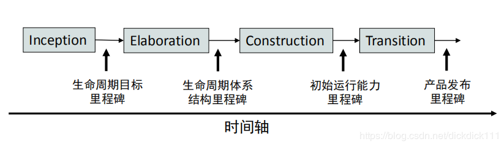

# 系统设计与分析homework3
## 一. 简答题
### 1. 简述瀑布模型、增量模型、螺旋模型（含原型方法），并分析优缺点
从项目特点、风险特征、人力资源利用角度思考
#### a. 瀑布模型
简述

- 瀑布模型（Waterfall Model） 是一个项目开发架构，开发过程是通过设计一系列阶段顺序展开的，从系统需求分析开始直到产品发布和维护，每个阶段都会产生循环反馈，因此，如果有信息未被覆盖或者发现了问题，那么最好 “返回”上一个阶段并进行适当的修改，项目开发进程从一个阶段“流动”到下一个阶段，这也是瀑布模型名称的由来。

优点

- 降低软件开发的复杂程度，提高软件开发过程的透明性，提高软件开发过程的可管理性。
- 推迟软件实现，强调在软件实现前必须进行分析和设计工作。
- 以项目的阶段评审和文档控制为手段有效地对整个开发过程进行指导，保证了阶段之间的正确衔接，能够及时发现并纠正开发过程中存在的缺陷，使产品达到预期的质量要求。

缺点

- 强调过程活动的线性顺序。
- 缺乏灵活性，尤其无法解决软件需求不明确或不准确的问题。
- 风险控制能力较弱。
- 瀑布模型中的软件活动是文档驱动的，当阶段之间规定过多的文档时，会极大地增加系统的工作量。
- 管理人员如果仅仅以文档的完成情况来评估项目完成进度，往往会产生错误的结论。

#### b. 增量模型
简述

- 增量模型首先对系统最核心或最清晰的需求进行分析、设计、实现、测试并集成到系统中，再按优先级逐步实现后续需求。

优点

- 增强客户对系统的信心
- 降低系统失败风险
- 提高系统可靠性
- 提高系统的稳定性和可维护性

缺点

- 建立初始模型时，作为增量基础的基本业务服务的确定有一定难度
- 增量粒度难以选择

#### c. 螺旋模型（含原型方法)
简述

- 螺旋模型主要针对大型软件项目的开发，其的最大特点就是引入了明确的风险管理机制。螺旋模型是风险驱动的迭代过程，强调可选方案和约束条件从而支持软件的重用，有助于将软件质量作为特殊目标融入产品开发之中。

优点

- 设计上的灵活性,可以在项目的各个阶段进行变更。
- 以小的分段来构建大型系统,使成本计算变得简单容易。
- 客户始终参与每个阶段的开发,保证了项目不偏离正确方向以及项目的可控性。
- 随着项目推进,客户始终掌握项目的最新信息 , 从而他或她能够和管理层有效地交互。
- 客户认可这种公司内部的开发方式带来的良好的沟通和高质量的产品。

缺点

- 很难让用户确信这种演化方法的结果是可以控制的。
- 建设周期长，而软件技术发展比较快，所以经常出现软件开发完毕后，和当前的技术水平有了较大的差距，无法满足当前用户需求。
- 管理人员需要相当丰富的风险评估
- 多次迭代会提高成本，延迟提交时间。

### 2.简述统一过程三大特点，与面向对象的方法有什么关系？
- 用例驱动
 - 用例是能够向用户提供有价值结果的系统中的一种功能，通过建立用例模型确定需求。基于用例模型，开发人员可以创建一系列实现这些用例的设计和实现模型。开发人员还可以审查每个后续建立的模型是否与用例模型一致。测试人员测试实现以确保实现模型的构件正确实现了用例。

- 以架构为中心
 - 软件架构是从不同的角度描述了即将构建的系统，他包含了系统的静态和动态特征。用例和架构是相互影响的。用例在实现时必须适合于架构，而架构必须预留空间以实现现有的或将来所有需要的用例。

- 迭代和增量的
 - 迭代是指工作流中的步骤，增量是指产品中增加的部分。迭代过程必须是受控的

统一过程将软件开发过程要素和软件工件要素整合在统一的软件工程框架中，是一个面向对象的程序开发方法论。

### 3. 简述统一过程四个阶段的划分准则是什么？每个阶段关键的里程碑是什么？
- 划分标准
 - RUP 中的软件生命周期在时间维度上被分解为四个顺序的阶段：初始阶段 (Inception)、精化阶段 (Elaboration)、构建阶段(Construction) 和产品交付阶段 (Transition)。每个阶段结束于一个主要的里程碑 (Major Milestone)，并在阶段结尾执行一次评估以确定这个阶段的目标是否已经满足。如果评估结果令人满意的话，可以允许项目进入下一个阶段。

- 每个阶段关键的里程碑

 - 初始阶段：生命周期目标 (Lifecycle Objective) 里程碑，包括一些重要的文档，如：项目构想 (Vision)、原始用例模型、原始业务风险评估、一个或者多个原型、原始业务案例等。通过对文档的评审确定用例需求理解正确、项目风险评估合理、阶段计划可行等。
 - 精化阶段：生命周期体系结构 (Lifecycle Architecture) 里程碑，包括风险分析文档、软件体系结构基线、项目计划、可执行的进化原型、初始版本的用户手册等。通过评审确定软件体系结构已经稳定、高风险的业务需求和技术机制已经解决、修订的项目计划可行等。
 - 构建阶段：初始运行能力 (Initial Operational Capability) 里程碑，包括可以运行的软件产品、用户手册等，它决定了产品是否可以在测试环境中进行部署。此刻，要确定软件、环境、用户是否可以开始系统的运行。
 - 产品化阶段/移交阶段：产品发布 (Product Release) 里程碑，确定最终目标是否实现，是否应该开始产品下一个版本的另一个开发周期。在一些情况下这个里程碑可能与下一个周期的初始阶段相重合。

### 4.软件企业为什么能按固定节奏生产、固定周期发布软件产品？它给企业项目管理带来哪些好处？
因为软件企业使用的是统一过程，而统一过程是也迭代过程。每个迭代都要针对不同的业务用例或系统用例进行细化和实现。每个阶段都有需要完成的目标，在每个阶段中存在一个或多个迭代，在每个迭代中，可以有多个工作流，企业只需要完成该阶段性的小目标即可。这样就可以最大限度的保持生产节奏固定、软件发布周期固定。

好处：

- 有利于产品的及时交付使用并获得用户客户的反馈
- 有利于量化团队和个人的生产率
- 降低了产品无法按照既定进度进入市场的风险

