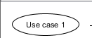
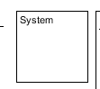
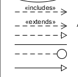
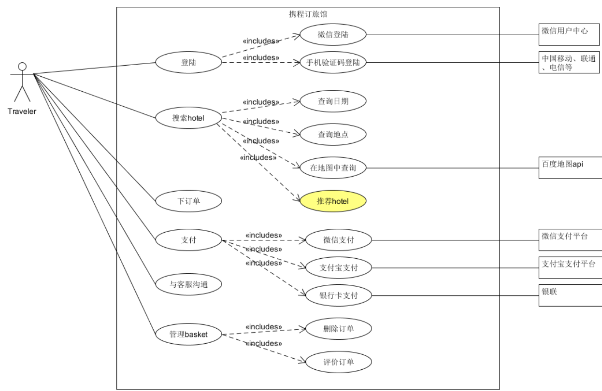

# 系统分析与设计homework4
## 一、简答题
### 1. 用例的概念
通俗来讲，用例是文本形式的情节描述，用以说明某参与者使用系统以实现某些目标，广泛应用于需求的发现和记录工作中。用例其本质是通过编写使用系统实现用户目标的情节来发现和记录功能性需求。

### 2. 用例和场景的关系？什么是主场景或 happy path？
- 场景（scenario）是参与者和系统之间的一系列特定的活动和交互，也称为用例实例。场景是使用系统的一个特定情节或用例的一条执行路径。
​
- 用例（use case）就是一组相关的成功和失败场景的集合，用来描述参与者如何使用系统来实现其目标。
​
- 主场景 happy path，是典型的、无条件的、理想方式的成功场景。happy path是一种默认情景，没有异常或错误条件。在用例建模中，happy path是主执行者完成了目标，所有有关人员的需求都得到了满足。

### 3.用例有哪些形式？
用例有三种常用形式

- 摘要——简洁的一段式概要，通常用于主成功场景。
- 非正式——非正式的段落格式。用几个段落覆盖不同场景
- 详述——详细编写所有步骤及各种变化，同时具有补充部分，如前置条件和成功保证。

### 4.对于复杂业务，为什么编制完整用例非常难？
复杂的业务本身业务流程就很复杂繁琐，而且涉及到的场景非常多，场景与场景之间也有各种各样的关联，编制完整用例需要建模相关知识和熟悉各个业务流程，还要注意用户交互的细节和相对于的支撑。

### 5. 什么是用例图？
用例图用以描述用例名称和参与者及其之间的关系。用例图是一种优秀的系统语境图；也就是说，用例图能够展示系统边界、位于边界之外的事物以及系统如何被使用。用例图可以作为沟通的工具，用以概括系统及其参与者的行为。

### 6.用例图的基本符号与元素？

- 参与者 (Actor)。表示与您的应用程序或系统进行交互的用户、组织或外部系统。用一个小人表示。

- 用例 (Use Case)。用例就是外部可见的系统功能，对系统提供的服务进行描述。用椭圆表示。

- 子系统 (Subsystem)。用来展示系统的一部分功能，这部分功能联系紧密。

- 用例图中涉及的关系有：关联、泛化、包含、扩展。
关系类型 说明 表示符号
 - 关联(Association)	参与者与用例之间的关系，指向消息接收方
 - 泛化(Inheritance)	参与者与用例之间的关系，指向父用例。
 - 包含(Include) 用例之间的关系，指向被包含者。
 - 扩展(Extend) 用例之间的关系，指向被继承者。

### 7. 用例图的画法与步骤
- 确定系统边界
- 确定参与者：如谁将使用该系统的主要功能、谁将需要该系统的支持以完成其工作、谁将需要维护、管理该系统，以及保持该系统处于工作状态等。
- 识别用例：如特定参与者希望系统提供什么功能、系统是否存储和检索信息，如果是，由哪个参与者触发、当系统改变状态时，是否通知参与者、是否存在影响系统的外部事件等。
- 确定用例间的关系：如包含关系、扩展关系和泛化关系。应用这些关系的目的是为了从系统中抽取出公共行为和其变体。

- 确定关联的外部支持系统，放在系统框右边。

### 8. 用例图给利益相关人与开发者的价值有哪些？
用例图可以从用户的视角描述一个系统的主要功能以及如何使用，比较符合人的自然认知，同时进行可视化，方便理解和获取需求，在整个开发过程及其他工作流中起到指导作用，同时也便于向系统用户即需求者阐述系统功能。

## 二. 建模练习题（用例模型）
- 选择2-3个你熟悉的类似业务的在线服务系统（或移动 APP），如定旅馆（携程、去哪儿等）、定电影票、背单词APP等，分别绘制它们用例图。并满足以下要求：
 - 请使用用户的视角，描述用户目标或系统提供的服务
 - 粒度达到子用例级别，并用 include 和 exclude 关联它们
 - 请用色彩标注出你认为创新（区别于竞争对手的）用例或子用例
 - 尽可能识别外部系统和服务

携程订旅馆用例图

然后，回答下列问题：

#### 1. 为什么相似系统的用例图是相似的？
相似系统面对的参与者和用例是相似的，用例之间的关系也是同构的。用户预期的功能都是相似的，即不同的同类系统一定具有一致基本功能以及带有自己特色的扩展功能。所以体现在用例图上也是相似的。

#### 2. 如果是定旅馆业务，请对比 Asg_RH 用例图，简述如何利用不同时代、不同地区产品的用例图，展现、突出创新业务和技术
可以利用人工智能、深度学习的技术挖掘出用户的订旅馆喜好，针对不同类型的用户给予推荐并推送，从而高效地帮助用户选择旅馆。
根据用户的评价以及反馈，采用自然语言处理的情感分析技术来进行对旅馆自动评分，筛选出优秀的旅馆优先展示，帮助用户选择更好的旅馆

#### 3. 如何利用用例图定位创新思路（业务创新、或技术创新、或商业模式创新）在系统中的作用
用不同颜色背景的用例图表示不同方面的创新的用例，直观分析。当用例图中的颜色较深，且与业务关系密切，开发人员应该重点关注该项创新，对其进行开发。

#### 4. 请使用 SCRUM 方法，选择一个用例图，编制某定旅馆开发的需求（backlog）开发计划表

|ID|Title|Est|Iter|Imp|
|---|---|---|---|---|
|1|登陆|2|1|
|2|搜索hotel|10|3|5|
|3|下订单|2|1|5|
|4|支付|5|2|5|
|5|与客服沟通|1|4|3|
|6|管理basket|5|2|5|

#### 5. 根据任务4，参考 使用用例点估算软件成本，给出项目用例点的估算

|用例|业务|计算|UC权重|
|---|---|---|---|
|1登陆|2|3|简单|
|2搜索hotel|8|5|复杂|
|3下订单|2|2|一般|
|4支付|2|4|简单|
|5与客服沟通|1|1|简单|
|6管理basket|3|3|一般|