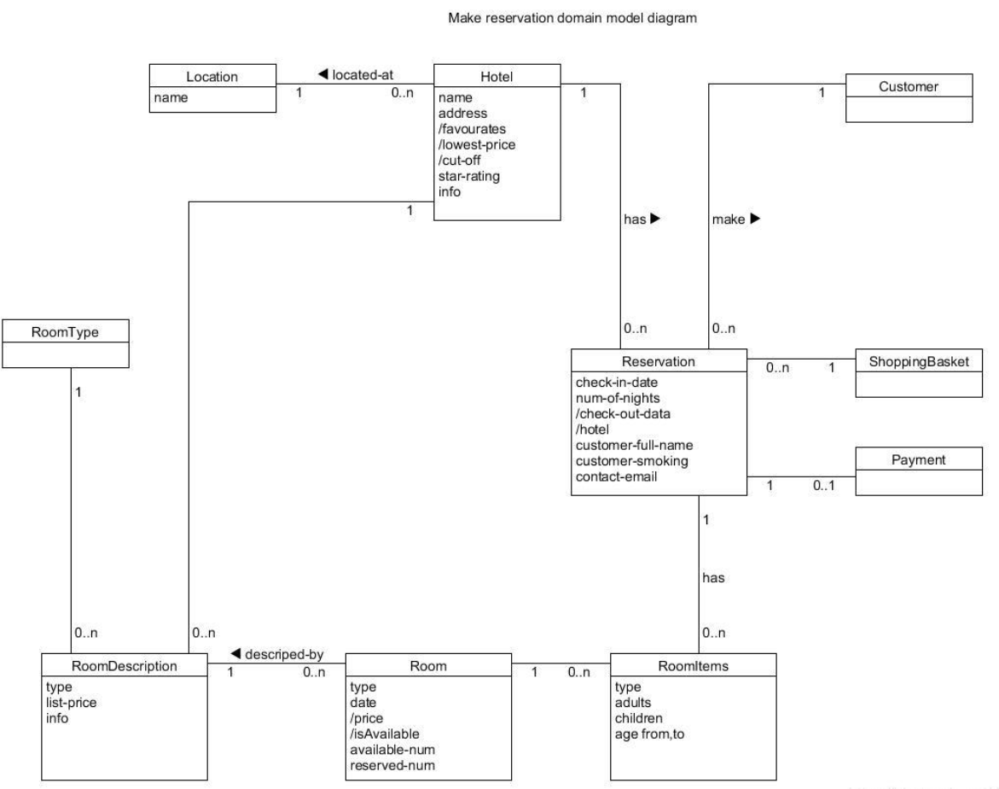
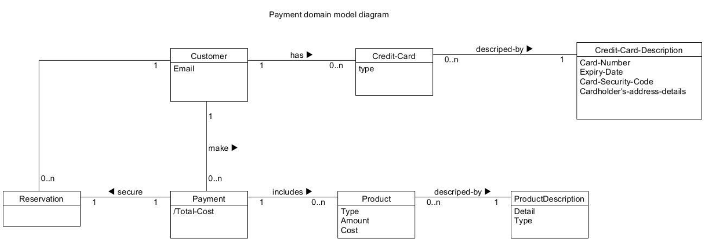

# 系统分析与设计homework6
## 使用 UMLet 建模
### 1、使用类图，分别对 Asg_RH 文档中 Make Reservation 用例以及 Payment 用例开展领域建模。然后，根据上述模型，给出建议的数据表以及主要字段，特别是主键和外键
- 注意事项： 
 - 对象必须是名词、特别是技术名词、报表、描述类的处理；
 - 关联必须有多重性、部分有名称与导航方向
 - 属性要注意计算字段

- 数据建模，为了简化描述仅需要给出表清单，例如： 
 - Hotel（ID/Key，Name，LoctionID/Fkey，Address……

Make Reservation 领域建模

数据建模如下：

- Hotel (ID/Key, Name, LoctionID/Fkey, ReservationID/Fkey, Address,  star-rating, info)
- Reservation (ReservationID/Key, RoomItemsID/Fkey, check-in-date, num-of-nights, customer-full-name, customer-smoking, contact-email)
- Location (LocationID/Key)
- Customer (CustomerID/Key, ReservationID/Fkey)
- ShoppingBasket (ShoppingBasketID/Key, ReservationID/Fkey)
- Payment (PaymentID/Key, ReservationID/Fkey)
- RoomItems (RoomItemsID/key, type, adults, children, age-from, age-to)
- Room (RoomID/key, RoomDescriptionID/Fkey, RoomitemsID/Fkey, type, date, available-num)
- RoomDescription (RoomDescriptionID/Key, type, list-price, info)

Payment 领域建模

数据建模如下：

- Customer (CustomerID/Key, ReservationID/Fkey)
- Reservation (ReservationID/Key)
- Credit-Card (Credit-CardID/Key, type, Credit-Card-DescriptionID/Fkey)
- Credit-Card-Description (Credit-Card-DescriptionID/Key, Card-Number, Expiry-Date, Card-Security-Code, Cardholder’s-address-details)
- Payment (PaymentID/Key, ProductID/Fkey)
- (ProductID/Key, type, amount)
- ProductDescription (detail, type)

### 2、使用 UML State Model，对每个订单对象生命周期建模
- 建模对象： 参考 Asg_RH 文档， 对 Reservation/Order 对象建模。
- 建模要求： 参考练习不能提供足够信息帮助你对订单对象建模，请参考现在 定旅馆 的旅游网站，尽可能分析围绕订单发生的各种情况，直到订单通过销售事件（柜台销售）结束订单。

